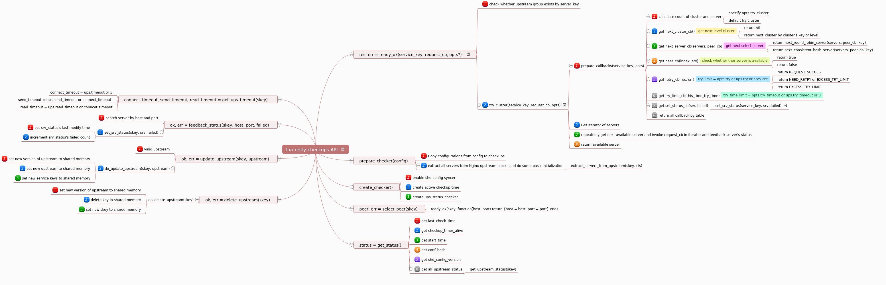

Name
====

lua-resty-checkups - Manage Nginx upstreams in pure ngx_lua

[](https://travis-ci.org/upyun/lua-resty-checkups)

Table of Contents
=================

* [Name](#name)
* [Status](#status)
* [Features](#features)
* [Synopsis](#synopsis)
* [Configuration](#configuration)
    * [Lua configuration](#lua-configuration)
    * [global configurations](#global-configuration)
    * [cluster configurations](#cluster-configuration)
    * [Nginx configuration](#nginx-configuration)
* [API](#api)
    * [init](#init)
    * [prepare_checker](#prepare_checker)
    * [create_checker](#create_checker)
    * [ready_ok](#ready_ok)
    * [select_peer](#select_peer)
    * [get_status](#get_status)
    * [get_ups_timeout](#get_ups_timeout)
    * [feedback_status](#feedback_status)
    * [update_upstream](#update_upstream)
    * [delete_upstream](#delete_upstream)
* [Copyright and License](#copyright-and-license)

Status
======

Probably production ready in most cases, though not yet proven in the wild. Please check the issues list and let me know if you have any problems / questions.

Features
========

* Periodically heartbeat to upstream servers
* Proactive and passive health check
* Dynamic upstream update
* Balance by weighted round-robin or consistent-hash
* Synchronize with Nginx upstream blocks
* Try clusters by levels or by keys

Compatibility
=============

* [ngx_http_lua_module](https://github.com/openresty/lua-nginx-module): v0.9.20 or higher.


Synopsis
========

```lua
    -- config.lua

    _M = {}

    _M.global = {
        checkup_timer_interval = 15,
        checkup_shd_sync_enable = true,
        shd_config_timer_interval = 1,
    }

    _M.ups1 = {
        cluster = {
            {
                servers = {
                    {host="127.0.0.1", port=4444, weight=10, max_fails=3, fail_timeout=10},
                }
            },
        },
    }

    return _M
```

```lua
    -- nginx.conf

    lua_package_path "/path/to/lua-resty-checkups/lib/?.lua;/path/to/config.lua;;";

    lua_shared_dict state 10m;
    lua_shared_dict mutex 1m;
    lua_shared_dict locks 1m;
    lua_shared_dict config 10m;

    server {
        listen 12350;
        return 200 12350;
    }

    server {
        listen 12351;
        return 200 12351;
    }
    
    init_by_lua_block {
    	local config = require "config"
    	local checkups = require "resty.checkups.api"
    	checkups.init(config)
    }

    init_worker_by_lua_block {
        local config = require "config"
        local checkups = require "resty.checkups.api"

        checkups.prepare_checker(config)
        checkups.create_checker()
    }

    server {
        location = /12350 {
            proxy_pass http://127.0.0.1:12350/;
        }
        location = /12351 {
            proxy_pass http://127.0.0.1:12351/;
        }

        location = /t {
            content_by_lua_block {
                local checkups = require "resty.checkups.api"

                local callback = function(host, port)
                local res = ngx.location.capture("/" .. port)
                    ngx.say(res.body)
                    return 1
                end

                local ok, err

                -- connect to a dead server, no upstream available
                ok, err = checkups.ready_ok("ups1", callback)
                if err then ngx.say(err) end

                -- add server to ups1
                ok, err = checkups.update_upstream("ups1", {
                    {
                        servers = {
                            {host="127.0.0.1", port=12350, weight=10, max_fails=3, fail_timeout=10},
                        }
                    },
                })

                if err then ngx.say(err) end
                ngx.sleep(1)
                ok, err = checkups.ready_ok("ups1", callback)
                if err then ngx.say(err) end
                ok, err = checkups.ready_ok("ups1", callback)
                if err then ngx.say(err) end

                -- add server to new upstream
                ok, err = checkups.update_upstream("ups2", {
                        {
                            servers = {
                                {host="127.0.0.1", port=12351},
                            }
                        },
                    })
                if err then ngx.say(err) end
                ngx.sleep(1)
                ok, err = checkups.ready_ok("ups2", callback)
                if err then ngx.say(err) end

                -- add server to ups2, reset rr state
                ok, err = checkups.update_upstream("ups2", {
                        {
                            servers = {
                                {host="127.0.0.1", port=12350, weight=10, max_fails=3, fail_timeout=10},
                                {host="127.0.0.1", port=12351, weight=10, max_fails=3, fail_timeout=10},
                            }
                        },
                    })
                if err then ngx.say(err) end
                ngx.sleep(1)
                ok, err = checkups.ready_ok("ups2", callback)
                if err then ngx.say(err) end
                ok, err = checkups.ready_ok("ups2", callback)
                if err then ngx.say(err) end
            }
        }
    }
```

A typical output of the `/t` location defined above is:

    no servers available
    12350
    12350
    12351
    12350
    12351

Configuration
=============

Lua configuration
-----------------

Configuration file of checkups is a lua module consists of two parts, the global part and the cluster part.


An example configuration file of checkups is shown below,


```lua
    -- config.lua

    -- Here is the global part

    _M = {}

    _M.global = {
        checkup_timer_interval = 15,
        checkup_timer_overtime = 60,
        default_heartbeat_enable = true,
        checkup_shd_sync_enable = true,
        shd_config_timer_interval = 1,
    }


    -- The rests parts are cluster configurations

    _M.redis = {
        enable = true,
        typ = "redis",
        timeout = 2,
        read_timeout = 15,
        send_timeout = 15,

        protected = true,

        cluster = {
            {   -- level 1
                    try = 2,
                servers = {
                    { host = "192.168.0.1", port = 6379, weight=10, max_fails=3, fail_timeout=10 },
                    { host = "192.168.0.2", port = 6379, weight=10, max_fails=3, fail_timeout=10 },
                }
            },
            {   -- level 2
                servers = {
                    { host = "192.168.0.3", port = 6379, weight=10, max_fails=3, fail_timeout=10 },
                }
            },
        },
    }

    _M.api = {
        enable = false,
        typ = "http",
            http_opts = {
            query = "GET /status HTTP/1.1\r\nHost: localhost\r\n\r\n",
            statuses = {
                    ["500"] = false,
                    ["502"] = false,
                    ["503"] = false,
                    ["504"] = false,
            },
        },

        mode = "hash",

        cluster = {
            dc1 = {
                servers = {
                    { host = "192.168.1.1", port = 1234, weight=10, max_fails=3, fail_timeout=10 },
                }
            },
            dc2 = {
                servers = {
                    { host = "192.168.1.2", port = 1234, weight=10, max_fails=3, fail_timeout=10 },
                }
            }
        }
    }

    _M.ups_from_nginx = {
        timeout = 2,

        cluster = {
            {   -- level 1
                upstream = "api.com",
            },
            {   -- level 2
                upstream = "api.com",
                upstream_only_backup = true,
            },
        },
    }

    return _M
```

global configurations
---------------------

* `checkup_timer_interval`: Interval of sending heartbeats to backend servers. Default is `5`.
* `checkup_timer_overtime`: Interval of checkups to expire the timer key. In most cases, you don't need to change this value. Default is `60`.
* `default_heartbeat_enable`: Checkups will sent heartbeats to servers by default or not. Default is `true`.
* `checkup_shd_sync_enable`: Create upstream syncer for each worker. If set to `false`, dynamic upstream will not work properly. Default is `true`.
* `shd_config_timer_interval`: Interval of syncing upstream list from shared memory. Default is equal to `checkup_timer_interval`.
* `ups_status_sync_enable`: If set to `true`, checkups will sync upstram status from checkups to Nginx upstream blocks. Default is `false`.
* `ups_status_timer_interval`: Interval of syncing upstream status from checkups to Nginx upstream blocks.

Cluster configurations
----------------------

* `skey`: `_M.xxxxx`. `xxxxx` is the `skey`(service key) of this Cluster.
* `enable`: Enable or disable heartbeats to servers. Default is `true`.
* `typ`: Cluster type, must be one of `general`, `redis`, `mysql`, `http`. Default is `general`.
	* `general`: Heartbeat by TCP `sock:connect`.
	* `redis`: Heartbeat by redis `PING`. [lua-resty-redis](https://github.com/openresty/lua-resty-redis) module is required.
	* `mysql`: Heartbeat by mysql `db:connect`. [lua-resty-mysql](https://github.com/openresty/lua-resty-mysql) module is required.
	* `http`: Heartbeat by HTTP request. You can setup customized HTTP request and response codes in `http_opts`.
* `timeout`: Connect timeout to upstream servers. Default is `5`.
* `read_timeout`: Read timeout to upstream servers. Default is equal to `timeout`.
* `send_timeout`: Write timeout to upstream servers. Default is equal to `timeout`.
* `http_opts`: HTTP heartbeat configurations. Only works for `typ="http"`.
	* `query`: HTTP request to heartbeat.
	* `statuses`: If the code returned by server is set to `false`, then the server is considered to be failing.

* `mode`: Balance mode. Can be set to `hash`, `url_hash` or `ip_hash`. Checkups will balance servers by `hash_key`, `ngx.var.uri` or `ngx.var.remote_addr`. Default is `wrr`.
* `protected`: If set to `true` and all the servers in the cluster are failing, checkups will not mark the last failing server as unavailable(`err`), instead, it will be marked as `unstable`(still available in next try). Default is `true`.
* `cluster`: You can configure multiple levels according to the cluster priority, at each level you can configure a cluster of `servers`. Checkups will try next level only when all the servers in the prior level are consitered unavailable.

	Instead of trying clusters by levels, you can configure checkups trying clusters by key(see `api` cluster above). Remember you should also pass extra argument like `opts.cluster_key={"dc1", "dc2"}` or `opts.cluster_key={3, 1, 2}` to [checkups.read_ok](#ready_ok) to make checkups trying on the order of `dc1`, `dc2` or `level 3`, `level 1`, `level 2`. If you haven't passed `opts.cluster_key` to [checkups.ready_ok](#ready_ok), checkups will still try clusters by levels. As for the above `api` cluster, checkups will eventually return `no servers available`.
* `try`: Retry count. Default is the number of servers.
* `try_timeout`: Limits the time during which a request can be responsed, likewise nginx `proxy_next_upstream_timeout`.
* `servers`: Configuration for `servers` are listed as follows,
	* `weight`: Sets the weight of the server. Default is `1`.
	* `max_fails`: Sets the number of unsuccessful attempts to communicate with the server that should happen in the duration set by the `fail_timeout` parameter. By default, the number of unsuccessful attempts is set to `0`, which disables the accounting of attempts. What is considered an unsuccessful attempt is defined by `http_opts.statuses` if `typ="http"` or a `nil`/`false` return by [checkups.ready_ok](#ready_ok). This options is only available in round-robin.
	* `fail_timeout`: Sets the time during which the specified number of unsuccessful attempts to communicate with the server should happen to consider the server unavailable and the period of time the server will be considered unavailable. By default, the parameter is set to `10` seconds. This options is only available in round-robin.

* `upstream`: Name of Nginx upstream blocks. Checkups will extract servers from Nginx conf's upstream blocks in [prepare_checker](#prepare_checker). [lua-upstream-nginx-module](https://github.com/openresty/lua-upstream-nginx-module) module is required.
* `upstream_only_backup`: If set to `true`, checkups will only extract backup servers from Nginx upstream blocks.


Nginx configuration
-------------------

Add pathes of lua config file and checkups to `lua_package_path` and create lua shared dicts used by checkups. You should put these lines into `http` block of your Nginx config file.

    lua_package_path "/path/to/lua-resty-checkups/lib/?.lua;/path/to/config.lua;;";

    lua_shared_dict state 10m;
    lua_shared_dict mutex 1m;
    lua_shared_dict locks 1m;
    lua_shared_dict config 10m;


API
===



init
---------------
**syntax:** *init(config)*

**phase:** *init_by_lua*

Copy upstreams from `config.lua` to shdict, extract servers from Nginx upstream blocks and do some basic initialization.


prepare_checker
---------------

**syntax:** *prepare_checker(config)*

**phase:** *init_worker_by_lua*

Copy configurations from `config.lua` to worker checkups, extract servers from Nginx upstream blocks and do some basic initialization. 


create_checker
--------------

**syntax:** *create_checker()*

**phase:** *init_worker_by_lua*

Create heartbeat timer and upstream sync timer. Only one heartbeat timer will be created among all the workers. It's highly recommended to call this method in `init_worker` phase.

ready_ok
--------

**syntax:** *res, err = ready_ok(skey, callback, opts?)*

**phase:** *rewrite_by_lua&#42;, access_by_lua&#42;, content_by_lua&#42;, ngx.timer.&#42;*

Select an available `peer` from cluster `skey` and call `callback(peer.host, peer.port, opts)`.

The `opts` table accepts the following fields,

* `cluster_key`: Try clusters by `cluster_key`. Checkups will try clusters on the order of `cluster_key`. `clusters_key` can be the name of the clusters or the level of the clusters. clusters eg: `{"cluster_name_A", "name_B", "name_C"}`. levels eg: `{3, 2, 1}`.
* `hash_key`: Key used in `hash` balance mode. If not set, `ngx.var.uri` will be used.
* `try`: Retry will be no more than `try` times.
* `try_timeout`: Limits the time during which a request can be responsed, likewise nginx `proxy_next_upstream_timeout`.

Returns what `callback` returns on success, or returns `nil` and a string describing the error otherwise.

If `callback` returns `nil` or `false`, checkups will consider it to be a failed try and will retry `callback` with another peer. So, **always remember not to return `nil` or `false` after a successful callback.**

select_peer
-----------

**syntax:** *peer, err = select_peer(skey)*

**context:** *rewrite_by_lua&#42;, access_by_lua&#42;, content_by_lua&#42;, balancer_by_lua*

Select an available peer from cluster `skey`.

Return a table containing `host` and `port` of an available peer.

In case of errors, returns nil with a string describing the error.

get_status
----------

**syntax:** *status = get_status()*

**phase:** *rewrite_by_lua&#42;, access_by_lua&#42;, content_by_lua&#42;, ngx.timer.&#42;*

Return checkups status in `json` format.

get_ups_timeout
---------------

**syntax:** *connect_timeout, send_timeout, read_timeout = get_ups_timeout(skey)*

**phase:** *rewrite_by_lua&#42;, access_by_lua&#42;, content_by_lua&#42;, ngx.timer.&#42;*

Return timeout of cluster `skey`.

feedback_status
---------------

**syntax:** *ok, err = feedback_status(skey, host, port, failed)*

**context:** *rewrite_by_lua&#42;, access_by_lua&#42;, content_by_lua&#42;, ngx.timer.&#42;, balancer_by_lua.&#42;*

Mark server `host:port` in cluster `skey` as failed(`true`) or available(`false`).

Returns `1` on success, or returns `nil` and a string describing the error otherwise.

update_upstream
---------------

**syntax:** *ok, err = update_upstream(skey, upstream)*

**phase:** *rewrite_by_lua&#42;, access_by_lua&#42;, content_by_lua&#42;, ngx.timer.&#42;*

Update cluster `skey`. `upstream` is in the same format as `cluster` in `config.lua`.

Returns `true` on success, or returns `false` and a string describing the error otherwise.

delete_upstream
---------------

**syntax:** *ok, err = delete_upstream(skey)*

**phase:** *rewrite_by_lua&#42;, access_by_lua&#42;, content_by_lua&#42;, ngx.timer.&#42;*

Delete cluster `skey` from upstream list.

Returns `true` on success, or returns `false` and a string describing the error otherwise.

Copyright and License
=====================

The bundle itself is licensed under the 2-clause BSD license.

Copyright (c) 2016, UPYUN(又拍云) Inc.

This module is licensed under the terms of the BSD license.

Redistribution and use in source and binary forms, with or without
modification, are permitted provided that the following conditions are
met:

* Redistributions of source code must retain the above copyright notice, this list of conditions and the following disclaimer.
* Redistributions in binary form must reproduce the above copyright notice, this list of conditions and the following disclaimer in the documentation and/or other materials provided with the distribution.

THIS SOFTWARE IS PROVIDED BY THE COPYRIGHT HOLDERS AND CONTRIBUTORS "AS
IS" AND ANY EXPRESS OR IMPLIED WARRANTIES, INCLUDING, BUT NOT LIMITED
TO, THE IMPLIED WARRANTIES OF MERCHANTABILITY AND FITNESS FOR A
PARTICULAR PURPOSE ARE DISCLAIMED. IN NO EVENT SHALL THE COPYRIGHT
HOLDER OR CONTRIBUTORS BE LIABLE FOR ANY DIRECT, INDIRECT, INCIDENTAL,
SPECIAL, EXEMPLARY, OR CONSEQUENTIAL DAMAGES (INCLUDING, BUT NOT LIMITED
TO, PROCUREMENT OF SUBSTITUTE GOODS OR SERVICES; LOSS OF USE, DATA, OR
PROFITS; OR BUSINESS INTERRUPTION) HOWEVER CAUSED AND ON ANY THEORY OF
LIABILITY, WHETHER IN CONTRACT, STRICT LIABILITY, OR TORT (INCLUDING
NEGLIGENCE OR OTHERWISE) ARISING IN ANY WAY OUT OF THE USE OF THIS
SOFTWARE, EVEN IF ADVISED OF THE POSSIBILITY OF SUCH DAMAGE.

See Also
========
* [lua-nginx-module](https://github.com/openresty/lua-nginx-module)
